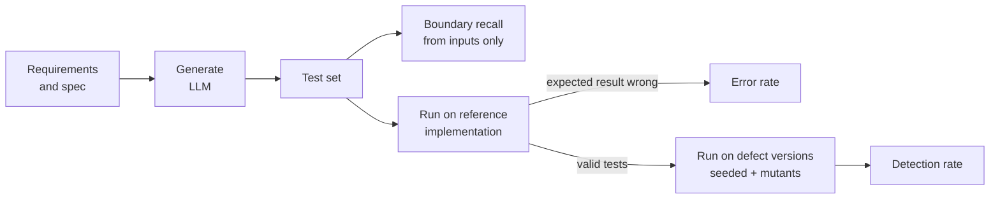
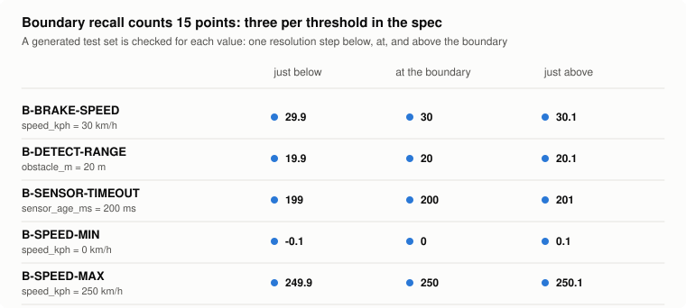
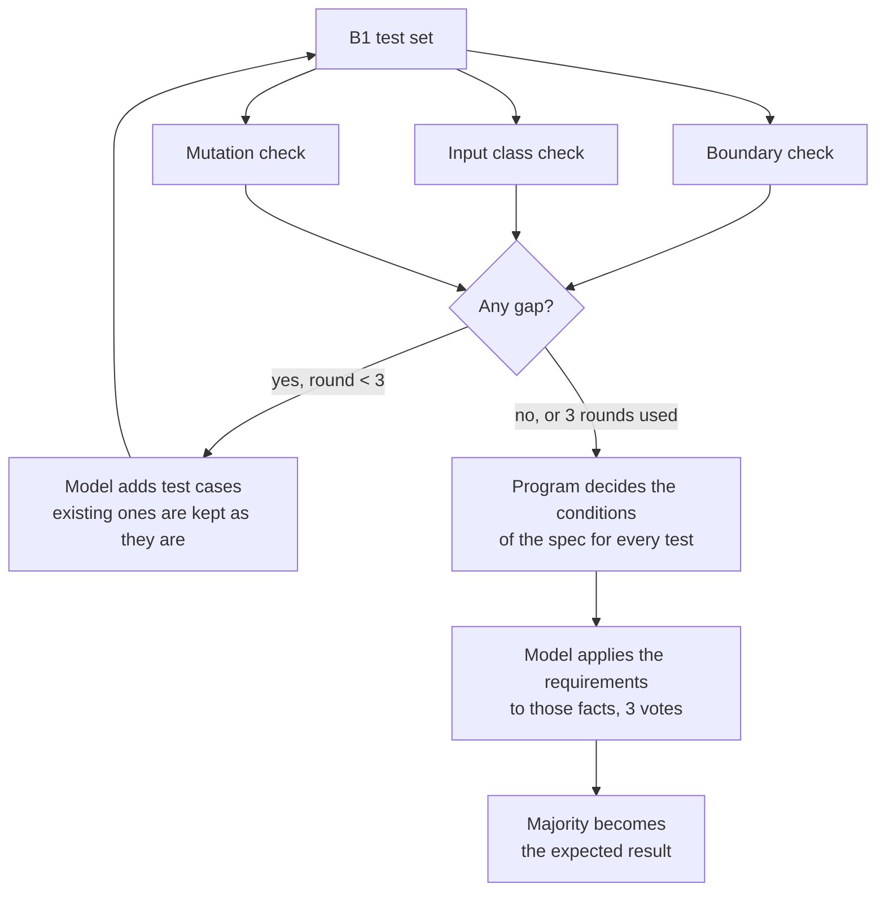
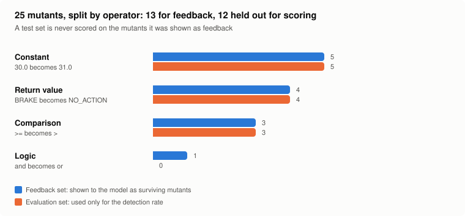
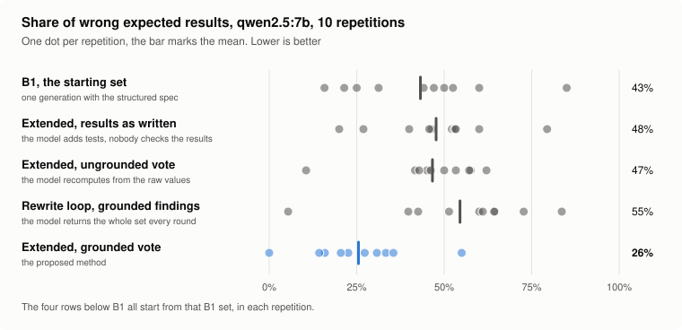

<div align="center">

# llm-testcase-review

**How good are LLM-written test cases, measured by running them?<br>An execution-based evaluation and a feedback loop that repairs the test set.**

[](https://github.com/eungyun-im/llm-testcase-review/actions/workflows/test.yml)


[Overview](#overview) · [Metrics](#metrics) · [Feedback refinement](#feedback-refinement) · [Experiment](#experiment-design) · [Results](#results) · [Layout](#repository-layout) · [Run](#running)

</div>

---

## Overview

An LLM can turn a requirement into test cases in seconds. Whether those test cases are any good is usually judged by a person reading them. That judgment varies between readers and cannot be repeated at scale.

This project measures LLM-written test cases by **executing** them:

1. Run every generated test on a reference implementation. A test whose expected result disagrees is a wrong test.
2. Run the remaining tests on versions of the code with known defects. A defect is detected when at least one test fails on it.

On top of that evaluation it implements **feedback refinement (FR)**: three automatic checks inspect a generated test set, and their findings are sent back to the model for up to three rounds.

The system under test is the AEB-lite decision function from [automotive-sw-qa](https://github.com/eungyun-im/automotive-sw-qa). ISO 26262-6 recommends boundary value analysis for software unit testing, which is why boundary coverage is a first-class metric here.

> **Status:** the evaluation, the feedback loop, the experiment runner and the result tables are implemented and tested. Three pilots on one small local model shaped the method. A confirmation run with the design frozen (10 repetitions, same model, [results below](#results)) lowers the share of wrong expected results from 43 % to 26 %; the two comparisons fixed in advance hold. The full experiment on a stronger model, the human baseline test set and the equivalent-mutant review are open.



## Metrics

All three are computed by scripts. A person decides only which mutants are equivalent.

| Metric | Definition | Answers |
|---|---|---|
| **Error rate** | tests that fail on the reference implementation ÷ generated tests | How often is the expected result wrong? |
| **Boundary recall** | boundary points used by some test ÷ boundary points in the spec | Are the thresholds tested just below, at, and just above? |
| **Detection rate** | defect versions on which a valid test fails ÷ defect versions (equivalent mutants excluded) | Do the tests catch real mistakes? |
| **Cost** | LLM calls and tokens per final test set | What does the improvement cost? |

The spec lists 5 boundaries, so there are 15 boundary points. Recall is reported two ways. **Simple** counts a point when its value appears in a test. **Strict** also requires the other inputs to let that boundary decide the output: 30.0 km/h counts only if an obstacle is in range.

<picture>
  <source media="(prefers-color-scheme: dark)" srcset="docs/img/boundary-points-dark.svg">
  
</picture>

Detection is measured only with **valid** tests. A wrong test fails everywhere and would otherwise count as detecting every defect.

## Feedback refinement

A test case has two parts, and the method gives them to different workers.



**Inputs: the model adds, it never rewrites.**

| Check | Uses | Finds | Feedback example |
|---|---|---|---|
| Boundary | Structured spec | Boundary points no test uses | `speed_kph = 30.1 (just above the B-BRAKE-SPEED boundary)` |
| Input class | Structured spec | Classes of inputs with no test | `valid speed of at least 30 km/h, fresh sensor data, no obstacle detected` |
| Mutation | Code under test | Code changes no test input would expose | ``line 28: `speed_kph >= BRAKE_SPEED_KPH` changed to `speed_kph > BRAKE_SPEED_KPH` `` |

**Expected results: a grounded cross-check, applied by the system.** The spec lists the atomic conditions the requirements are built from. A program decides each of them for every test, and the model sees only the outcome:

```
TC-07: speed is below 0 km/h: no; speed is above 250 km/h: no; sensor data is 200 ms old or older: yes;
       speed is at least 30 km/h: yes; an obstacle is detected: yes; the obstacle is within 20 m: yes
```

The model applies the requirements and their order to these facts. Three votes are taken, and the majority is written into the test set by the system. The model is not asked to correct anything.

Three rules keep the comparison fair:

- **No answer leakage.** Nothing in the feedback, the conditions or the input classes says what an output should be. The mutation check compares the mutant with the code under test on the test inputs and ignores expected results. Tests check each of these properties.
- **Separate defect sets.** Mutants are split in half, balanced by mutation operator. One half is used for feedback, the other only for scoring. Hand-seeded defects are never used as feedback.
- **The earlier forms stay as conditions.** The ungrounded cross-check (the model recomputes from the raw values) and the rewrite loop (the model returns the whole set every round) are still run, from the same starting set, so the change is measured and not assumed.

## Experiment design

| Condition | What happens | Role |
|---|---|---|
| B0 | Requirements, one generation | Common practice |
| B1 | Requirements, design techniques and the structured spec, one generation | Strong baseline |
| FR | B1 output, extended with all checks, expected results by grounded vote | Proposed method |
| FR without coverage feedback / cross-check / mutation feedback | FR with one part removed | Contribution of each part |
| FR with ungrounded cross-check | Expected results by a vote on the raw values | Does grounding matter? |
| FR, model rewrites the set | The earlier loop: all findings back to the model, whole set returned | Does the structure matter? |
| H | Human-designed test set, evaluated once | Reference point |

FR and its variants start from the same B1 output in each repetition, so they are compared pairwise (Wilcoxon signed-rank). Unpaired comparisons use Mann-Whitney U. Effect size is Vargha-Delaney A12, and p-values are Holm-adjusted.

**Defect versions for AEB-lite**

| Set | Count | Used for |
|---|---|---|
| Hand-seeded (F1 to F7) | 7 | Scoring only |
| Mutants, evaluation half | 12 | Scoring only |
| Mutants, feedback half | 13 | Mutation feedback only |

<picture>
  <source media="(prefers-color-scheme: dark)" srcset="docs/img/mutant-split-dark.svg">
  
</picture>

Both figures describe the experiment setup, not results. They are regenerated with `python -m tools.figures`.

Seeded defects are mistakes a developer could plausibly make: an exclusive comparison at a threshold, a missing range check, "no obstacle" treated as distance zero, checks in the wrong order, a distance rounded before comparison. See [`sut/defects.py`](sut/defects.py).

Everything a run produces is stored in SQLite: prompts, raw model output, parsed tests, detections and metrics ([`tcgen/schema.sql`](tcgen/schema.sql)). Any number in a result table can be recomputed from the stored tests.

## Results

### Confirmation run, design frozen

The method and the parser rules were frozen at commit `e8f63dd`, the plan in [`docs/experiment_plan.md`](docs/experiment_plan.md) was written before this run, and nothing was changed while it ran. `qwen2.5:7b` (7.6 B parameters, quantized, local with Ollama), 10 repetitions of 8 conditions: 80 runs, none failed, 526 model calls, 74 minutes of model time. Data: [`results/confirm/qwen2.5-7b.db`](results/confirm/qwen2.5-7b.db), tables [`.md`](results/confirm/qwen2.5-7b.md), error analysis [`-analysis.md`](results/confirm/qwen2.5-7b-analysis.md), equal-size comparison [`-equal-size.md`](results/confirm/qwen2.5-7b-equal-size.md).

<picture>
  <source media="(prefers-color-scheme: dark)" srcset="docs/img/error-rate-qwen2.5-7b-dark.svg">
  
</picture>

| Condition | Tests | Error rate | Detection: seeded | Detection: mutants | LLM calls |
|---|---|---|---|---|---|
| B0 single shot | 9.1 ± 1.5 | 32% ± 10% | 44% ± 16% | 53% ± 12% | 1 |
| B1 enhanced prompt | 26.7 ± 9.7 | 43% ± 21% | 57% ± 19% | 58% ± 16% | 1 |
| **FR** | 38.1 ± 13.5 | **26% ± 15%** | **70% ± 21%** | **87% ± 18%** | 7.7 ± 2.3 |
| FR without coverage feedback | 32.0 ± 8.0 | 27% ± 15% | 70% ± 17% | 79% ± 16% | 6.0 ± 1.7 |
| FR without cross-check | 36.6 ± 6.4 | 48% ± 17% | 64% ± 15% | 69% ± 14% | 3.1 ± 0.7 |
| FR without mutation feedback | 35.4 ± 10.0 | 27% ± 16% | 71% ± 16% | 83% ± 18% | 7.1 ± 1.9 |
| FR with ungrounded cross-check | 38.2 ± 14.0 | 47% ± 14% | 69% ± 23% | 74% ± 15% | 7.1 ± 1.9 |
| FR, model rewrites the set | 63.7 ± 18.3 | 55% ± 22% | 57% ± 29% | 67% ± 25% | 19.6 ± 6.6 |

**The two comparisons fixed in advance** (paired Wilcoxon on the error rate, Holm over the two)

| | Error rate | A12 | p | p (Holm) | FR lower in |
|---|---|---|---|---|---|
| H1: grounded vote vs vote on the raw values | 25.5% vs 46.6% | 0.15 | 0.006 | 0.012 | 9 of 10 repetitions |
| H2: system applies the vote vs model rewrites the set | 25.5% vs 54.5% | 0.12 | 0.014 | 0.014 | 9 of 10 repetitions |

The plan names a third primary comparison per model; here it is the effect across models (H3), which needs the other models and is still open.

What the confirmation shows, and what it does not:

- **Both predictions held** with the design frozen, for this model. Extending the set without any check (48 %) or with the ungrounded vote (47 %) does not lower the error rate; the grounded vote does (26 %); giving the model the same grounded findings but letting it rewrite the set gives 55 %.
- **The effect is smaller than the pilots suggested.** The third pilot showed 20 % ± 3 %. With 10 repetitions it is 26 % ± 15 %, and one repetition is at 55 %. A single vote was right 71 % of the time (pilot: 85 %), and results confirmed by all three votes 78 % (pilot: 95 %). The pilot overstated the method, which is the reason the design was frozen before this run.
- **It is not a solution to the problem.** One in four expected results is still wrong. 64 of the 98 wrong results of FR are in one input class, valid speed with sensor data too old, where the model states `BRAKE` and the requirements call for `FAULT`: the facts are given, and the priority between the requirements is still applied wrongly.
- **Detection improves, with less certainty.** Mutant detection 58 % → 87 % (p = 0.002; 0.041 after Holm over all 21 comparisons of the report), seeded defects 57 % → 70 % (p = 0.051, not significant). At equal test counts the gain shrinks but stays: seeded 57 % → 62 %, mutants 58 % → 78 %. The rewrite loop falls below the starting point at equal size (38 % and 52 %): its extra tests were mostly wrong.
- **Two parts did not show an effect.** Removing the coverage feedback or the mutation feedback left the error rate unchanged (27 %, 27 %). The coverage feedback raises boundary recall (97 % against 75 %) and the mutation feedback is within noise (83 % against 87 % mutant detection).
- **Limits:** one model, one stateless system, no human-designed baseline yet. The parser rules and the input classes were written while reading this model's pilot output.

### Pilots on a small local model

Three runs with `qwen2.5:7b` (7.6 B parameters, quantized, run locally with Ollama), five repetitions each. They are exploration: each run changed the method, so none of them tests it. No comparison is statistically significant after correction.

| Pilot | Method | What it showed | Data |
|---|---|---|---|
| 1 | Rewrite loop, ungrounded cross-check | Half of all expected results are wrong in every condition. The cross-check votes are right 45 % of the time, no better than the results they check | [`qwen2.5-7b.db`](results/pilot/qwen2.5-7b.db), [analysis](results/pilot/qwen2.5-7b-analysis.md) |
| 2 (stopped after 13 of 35 runs) | Rewrite loop, grounded cross-check, input class check | The grounded votes flag 93 % of the wrong results, and the error rate still stays at 39 %: the rewrite brings the mistakes back | [`qwen2.5-7b-v2-partial.db`](results/pilot/qwen2.5-7b-v2-partial.db), [analysis](results/pilot/qwen2.5-7b-v2-partial-analysis.md) |
| 3 | Additive loop, grounded vote applied by the system | Below | [`qwen2.5-7b-v3.db`](results/pilot/qwen2.5-7b-v3.db), [tables](results/pilot/qwen2.5-7b-v3.md), [analysis](results/pilot/qwen2.5-7b-v3-analysis.md) |

**Pilot 3** (40 runs, none failed, 240 model calls, 31 minutes of model time; mean ± standard deviation over 5 repetitions)

| Condition | Tests | Error rate | Boundary recall (simple / strict) | Input classes | Detection: seeded | Detection: mutants | LLM calls |
|---|---|---|---|---|---|---|---|
| B0 single shot | 9.6 ± 1.5 | 28% ± 11% | 24% ± 9% / 19% ± 12% | 71% ± 10% | 37% ± 13% | 55% ± 10% | 1 |
| B1 enhanced prompt | 25.8 ± 13.6 | 51% ± 10% | 59% ± 14% / 49% ± 17% | 71% ± 14% | 60% ± 26% | 63% ± 15% | 1 |
| **FR** | 38.4 ± 11.8 | **20% ± 3%** | 93% ± 15% / 81% ± 17% | 94% ± 8% | **83% ± 6%** | **88% ± 14%** | 8.4 ± 1.5 |
| FR without coverage feedback | 31.0 ± 11.9 | 17% ± 11% | 69% ± 12% / 61% ± 17% | 77% ± 16% | 71% ± 20% | 78% ± 20% | 6.2 ± 0.8 |
| FR without cross-check | 37.6 ± 9.2 | 54% ± 9% | 95% ± 12% / 84% ± 20% | 94% ± 8% | 71% ± 23% | 78% ± 11% | 3.6 ± 0.5 |
| FR without mutation feedback | 35.2 ± 10.3 | 21% ± 7% | 100% ± 0% / 88% ± 23% | 97% ± 6% | 89% ± 6% | 90% ± 14% | 6.2 ± 1.3 |
| FR with ungrounded cross-check | 38.6 ± 12.7 | 49% ± 11% | 93% ± 15% / 77% ± 21% | 94% ± 8% | 77% ± 13% | 80% ± 13% | 7.4 ± 1.7 |
| FR, model rewrites the set | 41.8 ± 16.8 | 55% ± 10% | 92% ± 11% / 71% ± 21% | 83% ± 16% | 66% ± 30% | 73% ± 20% | 14.2 ± 1.6 |

What the pilots show, as observations to test in the full experiment and not as findings:

- **The errors are in the expected results, and the model cannot check itself.** Extending B1 without a cross-check leaves the error rate at 54 %, and a vote on the raw values leaves it at 49 %. In pilot 1 the model's votes were right 45 % of the time.
- **Grounding the vote changes that.** With the conditions decided by a program, single votes were right 85 % of the time, unanimous results 95 %, and the error rate of the test set fell to 20 %. In all five repetitions FR was below B1, below the ungrounded vote and below the rewrite loop (A12 = 0.00, p = 0.062, which is the smallest value five pairs can give).
- **An accurate check is not enough if the model does the fixing.** The rewrite loop received the same grounded findings and ended at 55 %, with the most calls (14.2).
- **Coverage feedback finds the missing cases.** The defect that only shows without an obstacle was detected in 0 of 5 runs of B0, 2 of B1 and 4 of FR. In pilot 1 it was found once in 15 runs.
- **The mutation feedback did not earn its place here.** Removing it changed nothing measurable (89 % and 90 % detection without it).
- **What is still wrong is concentrated.** 22 of the 39 wrong results of FR are in one input class, valid speed with sensor data too old: the facts are given, and the model applies the order of the requirements wrongly.

The pilots also changed the instrument. Reading the raw answers of a first trial showed two cases where the parser dropped usable tables. The rules for what is forgiven and what is counted as a format error are written down in [`tcgen/schema.py`](tcgen/schema.py), and that trial was discarded. Where a result is wrong, and how well each form of the cross-check points at it, is computed from the stored data by `python -m tcgen.analysis`.

### Still open

The other models of [`docs/experiment_plan.md`](docs/experiment_plan.md) (a smaller one is running, a stronger one needs another download or an API key), the human-designed baseline (condition H), and a second system. The tables are produced by `python -m tcgen.report`, the error analysis by `python -m tcgen.analysis`, the equal-size comparison by `python -m tcgen.equal_size`, the figure by `python -m tools.result_figures`.

The pipeline is exercised in CI with a built-in simulator instead of a model. The simulator exists to run every code path. Its output is marked as simulated in the database and in the report, and it is not evidence about any real model.

## Repository layout

```
llm-testcase-review/
├── requirements/        Structured spec: inputs, requirements, boundaries
├── prompts/             B0, B1, feedback and cross-check prompts
├── sut/
│   ├── aeb.py           Reference implementation (the oracle)
│   └── defects.py       Hand-seeded defect versions F1 to F7
├── tcgen/
│   ├── spec.py          Spec loading and boundary points
│   ├── schema.py        Test case format and tolerant CSV parsing
│   ├── metrics.py       Error rate, boundary recall, detection rate
│   ├── mutation.py      Mutant generation and the feedback / evaluation split
│   ├── checks.py        Boundary, input class and mutation check, cross-check (grounded and not)
│   ├── refine.py        Additive refinement, and the earlier rewrite loop
│   ├── analysis.py      Where results are wrong, how well the cross-check finds them
│   ├── equal_size.py    Detection at equal test counts
│   ├── generate.py      B0 and B1 generation
│   ├── llm.py           LLM clients: Claude, and any OpenAI-compatible server (local or hosted)
│   ├── simulator.py     Stand-in client for pipeline tests
│   ├── experiment.py    Experiment runner
│   ├── stats.py         Wilcoxon, Mann-Whitney, A12, Holm
│   ├── report.py        Result tables
│   └── store.py         SQLite store
├── data/
│   ├── human/           Human baseline test set (condition H)
│   └── mutants/         Equivalent-mutant decisions
├── results/pilot/       The three pilots (exploration)
├── results/confirm/     The confirmation run with the frozen design
└── tests/
```

## Running

```bash
pip install -r requirements.txt
pytest -v
```

Run the whole pipeline on the simulator (no API key needed):

```bash
python -m tcgen.experiment --client simulated --reps 3 --db data/results.db
```

```bash
python -m tcgen.report --db data/results.db
```

Run on a model on this machine, with [Ollama](https://ollama.com) (no account and no key):

```bash
ollama pull qwen2.5:7b
```

```bash
python -m tcgen.experiment --client openai --model qwen2.5:7b --reps 5 --db results/pilot/qwen2.5-7b.db
```

The same client reaches any hosted service with an OpenAI-compatible API: pass its address with `--base-url` and the name of the environment variable that holds the key with `--api-key-env`.

Run on Claude (needs `pip install -r requirements-llm.txt` and API credentials):

```bash
python -m tcgen.experiment --client anthropic --reps 10 --db data/results.db
```

The model and effort level are fixed for a run and recorded with it. No fallback model is configured: a refused or truncated generation is stored as a failed run instead of being answered by a different model.

## Roadmap

**Core**

- [x] Execution-based metrics: error rate, boundary recall (simple and strict), detection rate
- [x] Mutant generation with a feedback / evaluation split
- [x] Hand-seeded defect versions
- [x] Boundary, input class and mutation check
- [x] Grounded cross-check: conditions decided by a program, requirements applied by the model
- [x] Additive refinement with ablations, and the earlier forms as comparison conditions
- [x] Experiment runner, SQLite store, result tables and statistics
- [ ] Human baseline test set, designed before looking at the defects
- [ ] Equivalent-mutant review
- [x] Three pilots on a small local model, with error analysis
- [x] Design of the full experiment written down before it is run
- [x] Confirmation run with the frozen design, 10 repetitions, one model
- [ ] The other models of the plan
- [ ] Human-designed baseline

**Next**

- [ ] Same-size subsampling, to separate "better tests" from "more tests"
- [ ] Second system: UDS diagnostics from [ecu-quality-gate](https://github.com/eungyun-im/ecu-quality-gate), with sequence-style test cases

**Later**

- [ ] Stateful requirements (fault latch and recovery)
- [ ] Comparison across models

## References

- Jia and Harman (2011). An analysis and survey of the development of mutation testing. IEEE TSE.
- Just et al. (2014). Are mutants a valid substitute for real faults in software testing? FSE.
- Barr et al. (2015). The oracle problem in software testing: a survey. IEEE TSE.
- Dakhel et al. (2023). Effective test generation using pre-trained large language models and mutation testing. arXiv:2308.16557.
- Madaan et al. (2023). Self-Refine: iterative refinement with self-feedback. NeurIPS.
- Wang et al. (2023). Self-consistency improves chain of thought reasoning in language models. ICLR.
- Arcuri and Briand (2011). A practical guide for using statistical tests to assess randomized algorithms in software engineering. ICSE.
- ISO 26262-6:2018. Road vehicles, functional safety, product development at the software level.
