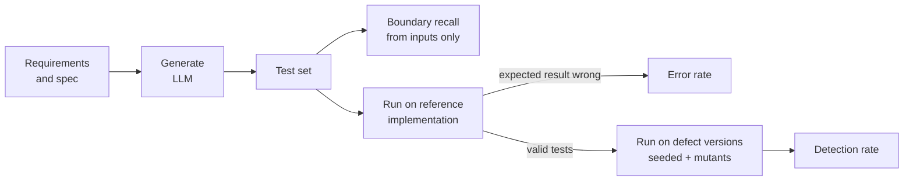
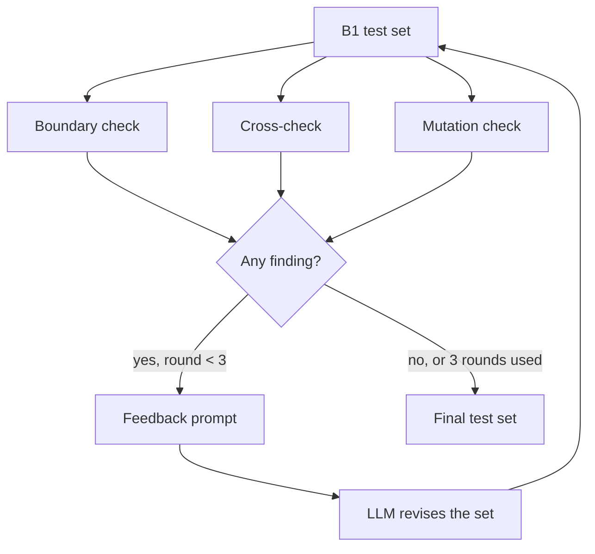

<div align="center">

# llm-testcase-review

**How good are LLM-written test cases, measured by running them?<br>An execution-based evaluation and a feedback loop that repairs the test set.**

[](https://github.com/eungyun-im/llm-testcase-review/actions/workflows/test.yml)


[Overview](#overview) · [Metrics](#metrics) · [Feedback refinement](#feedback-refinement) · [Experiment](#experiment-design) · [Results](#results) · [Layout](#repository-layout) · [Run](#running)

</div>

---

## Overview

An LLM can turn a requirement into test cases in seconds. Whether those test cases are any good is usually judged by a person reading them. That judgment varies between readers and cannot be repeated at scale.

This project measures LLM-written test cases by **executing** them:

1. Run every generated test on a reference implementation. A test whose expected result disagrees is a wrong test.
2. Run the remaining tests on versions of the code with known defects. A defect is detected when at least one test fails on it.

On top of that evaluation it implements **feedback refinement (FR)**: three automatic checks inspect a generated test set, and their findings are sent back to the model for up to three rounds.

The system under test is the AEB-lite decision function from [automotive-sw-qa](https://github.com/eungyun-im/automotive-sw-qa). ISO 26262-6 recommends boundary value analysis for software unit testing, which is why boundary coverage is a first-class metric here.

> **Status:** the evaluation, the feedback loop, the experiment runner and the result tables are implemented and tested. A pilot has been run on one small local model (5 repetitions, [results below](#results)). The full experiment on a stronger model, the human baseline test set and the equivalent-mutant review are open.



## Metrics

All three are computed by scripts. A person decides only which mutants are equivalent.

| Metric | Definition | Answers |
|---|---|---|
| **Error rate** | tests that fail on the reference implementation ÷ generated tests | How often is the expected result wrong? |
| **Boundary recall** | boundary points used by some test ÷ boundary points in the spec | Are the thresholds tested just below, at, and just above? |
| **Detection rate** | defect versions on which a valid test fails ÷ defect versions (equivalent mutants excluded) | Do the tests catch real mistakes? |
| **Cost** | LLM calls and tokens per final test set | What does the improvement cost? |

The spec lists 5 boundaries, so there are 15 boundary points. Recall is reported two ways. **Simple** counts a point when its value appears in a test. **Strict** also requires the other inputs to let that boundary decide the output: 30.0 km/h counts only if an obstacle is in range.

<picture>
  <source media="(prefers-color-scheme: dark)" srcset="docs/img/boundary-points-dark.svg">
  
</picture>

Detection is measured only with **valid** tests. A wrong test fails everywhere and would otherwise count as detecting every defect.

## Feedback refinement



| Check | Uses | Finds | Feedback example |
|---|---|---|---|
| Boundary | Structured spec | Boundary points no test uses | `speed_kph = 30.1 (just above the B-BRAKE-SPEED boundary)` |
| Cross-check | Requirement text | Tests whose expected result loses a 3-vote recomputation | `TC-07: an independent recomputation gives BRAKE` |
| Mutation | Code under test | Code changes no test input would expose | ``line 28: `speed_kph >= BRAKE_SPEED_KPH` changed to `speed_kph > BRAKE_SPEED_KPH` `` |

Two rules keep the comparison fair:

- **No answer leakage.** Feedback never says which tests failed on the reference implementation. The mutation check compares the mutant with the code under test on the test inputs and ignores expected results.
- **Separate defect sets.** Mutants are split in half, balanced by mutation operator. One half is used for feedback, the other only for scoring. Hand-seeded defects are never used as feedback.

## Experiment design

| Condition | What the model gets | Role |
|---|---|---|
| B0 | Requirements, one generation | Common practice |
| B1 | Requirements, design techniques and the structured spec, one generation | Strong baseline |
| FR | B1 output, refined with all three checks | Proposed method |
| FR without boundary / cross-check / mutation | FR with one check removed | Contribution of each check |
| H | Human-designed test set, evaluated once | Reference point |

FR and its ablations start from the same B1 output in each repetition, so they are compared pairwise (Wilcoxon signed-rank). Unpaired comparisons use Mann-Whitney U. Effect size is Vargha-Delaney A12, and p-values are Holm-adjusted.

**Defect versions for AEB-lite**

| Set | Count | Used for |
|---|---|---|
| Hand-seeded (F1 to F7) | 7 | Scoring only |
| Mutants, evaluation half | 12 | Scoring only |
| Mutants, feedback half | 13 | Mutation feedback only |

<picture>
  <source media="(prefers-color-scheme: dark)" srcset="docs/img/mutant-split-dark.svg">
  
</picture>

Both figures describe the experiment setup, not results. They are regenerated with `python -m tools.figures`.

Seeded defects are mistakes a developer could plausibly make: an exclusive comparison at a threshold, a missing range check, "no obstacle" treated as distance zero, checks in the wrong order, a distance rounded before comparison. See [`sut/defects.py`](sut/defects.py).

Everything a run produces is stored in SQLite: prompts, raw model output, parsed tests, detections and metrics ([`tcgen/schema.sql`](tcgen/schema.sql)). Any number in a result table can be recomputed from the stored tests.

## Results

### Pilot on a small local model

One model, five repetitions, to find out whether the pipeline holds up against real output and what the numbers look like. It is not the experiment: the model is small, n = 5, and no comparison below is statistically significant.

| | |
|---|---|
| Model | `qwen2.5:7b` (7.6 B parameters, 4-bit quantized), run locally with Ollama on one GPU |
| Runs | 30 (6 conditions × 5 repetitions), none failed |
| Model calls | 220, 247 k input and 116 k output tokens, 111 minutes |
| Date | 2026-10-09 |
| Data | [`results/pilot/qwen2.5-7b.db`](results/pilot/qwen2.5-7b.db): every prompt, raw answer, parsed test and detection. Tables: [`results/pilot/qwen2.5-7b.md`](results/pilot/qwen2.5-7b.md) |

**Metrics by condition** (mean ± standard deviation over 5 repetitions)

| Condition | Tests | Error rate | Boundary recall (simple / strict) | Detection: seeded | Detection: mutants | LLM calls |
|---|---|---|---|---|---|---|
| B0 single shot | 10.2 ± 0.4 | 45% ± 12% | 24% ± 8% / 23% ± 8% | 31% ± 12% | 42% ± 6% | 1 |
| B1 enhanced prompt | 27.2 ± 12.5 | 50% ± 13% | 64% ± 10% / 53% ± 24% | 51% ± 16% | 53% ± 15% | 1 |
| FR feedback refinement | 41.8 ± 13.6 | 52% ± 16% | 91% ± 17% / 72% ± 32% | 51% ± 26% | 65% ± 23% | 13 |
| FR without boundary feedback | 45.8 ± 24.5 | 57% ± 11% | 65% ± 6% / 55% ± 14% | 49% ± 19% | 60% ± 18% | 13 |
| FR without cross-check | 33.8 ± 4.0 | 55% ± 13% | 100% ± 0% / 76% ± 33% | 66% ± 13% | 80% ± 13% | 3.0 ± 1.0 |
| FR without mutation feedback | 65.2 ± 35.0 | 56% ± 18% | 96% ± 6% / 67% ± 28% | 54% ± 19% | 68% ± 19% | 13 |

What the pilot shows, as observations to test in the full experiment and not as findings:

- **Half of the expected results are wrong, in every condition.** The error rate stays between 45 % and 57 %. This model chooses inputs far better than it derives the output for them, and feedback does not change that.
- **Boundary feedback does what it is for.** Simple boundary recall goes from 24 % (B0) to 64 % (B1) to 91 % (FR), and it falls back to 65 % when the boundary check is removed. Strict recall follows at a distance: the value is there, but the other inputs often do not let that boundary decide the output.
- **More tests did not mean more defects found.** FR quadruples the test count over B0, but detection of the seeded defects does not move from B1 to FR (51 % and 51 %), because detection only counts tests whose expected result is right.
- **The cross-check cost most and helped least.** The variant without it used 3 calls instead of 13 and had the highest detection (66 % seeded, 80 % mutants). A plausible reason: the cross-check asks the same model to recompute an answer it already gets wrong half the time, so its votes are noise. With five repetitions this can still be chance (p = 0.125 before correction).
- **One defect was almost never found.** F5, "no obstacle" treated as distance zero, was detected in 1 of 15 runs of B0, B1 and FR. Only 99 of the 1120 generated tests have no obstacle at all.

The pilot also changed the instrument. Reading the raw answers of a first trial run showed two cases where the parser dropped usable tables: a blank line after the header, and a remark after the expected result. Both are now accepted, the rules for what is forgiven and what is counted as a format error are written down in [`tcgen/schema.py`](tcgen/schema.py), and the trial run was discarded. The numbers above come from one run with the final rules.

### Full experiment

Not run yet. It needs a stronger model, 10 repetitions and the human baseline (condition H). The tables are produced by `python -m tcgen.report`:

- **Table 1.** Metrics by condition, as above, with condition H.
- **Table 2.** Seeded defects detected, one row per defect F1 to F7.
- **Table 3.** Statistical comparisons (test, means, A12, p, Holm-adjusted p).

The pipeline is exercised in CI with a built-in simulator instead of a model. The simulator exists to run every code path. Its output is marked as simulated in the database and in the report, and it is not evidence about any real model.

## Repository layout

```
llm-testcase-review/
├── requirements/        Structured spec: inputs, requirements, boundaries
├── prompts/             B0, B1, feedback and cross-check prompts
├── sut/
│   ├── aeb.py           Reference implementation (the oracle)
│   └── defects.py       Hand-seeded defect versions F1 to F7
├── tcgen/
│   ├── spec.py          Spec loading and boundary points
│   ├── schema.py        Test case format and tolerant CSV parsing
│   ├── metrics.py       Error rate, boundary recall, detection rate
│   ├── mutation.py      Mutant generation and the feedback / evaluation split
│   ├── checks.py        Boundary check, cross-check, mutation check
│   ├── refine.py        Feedback refinement loop
│   ├── generate.py      B0 and B1 generation
│   ├── llm.py           LLM clients: Claude, and any OpenAI-compatible server (local or hosted)
│   ├── simulator.py     Stand-in client for pipeline tests
│   ├── experiment.py    Experiment runner
│   ├── stats.py         Wilcoxon, Mann-Whitney, A12, Holm
│   ├── report.py        Result tables
│   └── store.py         SQLite store
├── data/
│   ├── human/           Human baseline test set (condition H)
│   └── mutants/         Equivalent-mutant decisions
├── results/pilot/       Stored runs and tables of the pilot
└── tests/
```

## Running

```bash
pip install -r requirements.txt
pytest -v
```

Run the whole pipeline on the simulator (no API key needed):

```bash
python -m tcgen.experiment --client simulated --reps 3 --db data/results.db
```

```bash
python -m tcgen.report --db data/results.db
```

Run on a model on this machine, with [Ollama](https://ollama.com) (no account and no key):

```bash
ollama pull qwen2.5:7b
```

```bash
python -m tcgen.experiment --client openai --model qwen2.5:7b --reps 5 --db results/pilot/qwen2.5-7b.db
```

The same client reaches any hosted service with an OpenAI-compatible API: pass its address with `--base-url` and the name of the environment variable that holds the key with `--api-key-env`.

Run on Claude (needs `pip install -r requirements-llm.txt` and API credentials):

```bash
python -m tcgen.experiment --client anthropic --reps 10 --db data/results.db
```

The model and effort level are fixed for a run and recorded with it. No fallback model is configured: a refused or truncated generation is stored as a failed run instead of being answered by a different model.

## Roadmap

**Core**

- [x] Execution-based metrics: error rate, boundary recall (simple and strict), detection rate
- [x] Mutant generation with a feedback / evaluation split
- [x] Hand-seeded defect versions
- [x] Boundary check, cross-check and mutation check
- [x] Feedback refinement loop with ablations
- [x] Experiment runner, SQLite store, result tables and statistics
- [ ] Human baseline test set, designed before looking at the defects
- [ ] Equivalent-mutant review
- [x] Pilot on a real model (small local model, 5 repetitions)
- [ ] Full run on a stronger model, with results published here

**Next**

- [ ] Same-size subsampling, to separate "better tests" from "more tests"
- [ ] Second system: UDS diagnostics from [ecu-quality-gate](https://github.com/eungyun-im/ecu-quality-gate), with sequence-style test cases

**Later**

- [ ] Stateful requirements (fault latch and recovery)
- [ ] Comparison across models

## References

- Jia and Harman (2011). An analysis and survey of the development of mutation testing. IEEE TSE.
- Just et al. (2014). Are mutants a valid substitute for real faults in software testing? FSE.
- Barr et al. (2015). The oracle problem in software testing: a survey. IEEE TSE.
- Dakhel et al. (2023). Effective test generation using pre-trained large language models and mutation testing. arXiv:2308.16557.
- Madaan et al. (2023). Self-Refine: iterative refinement with self-feedback. NeurIPS.
- Wang et al. (2023). Self-consistency improves chain of thought reasoning in language models. ICLR.
- Arcuri and Briand (2011). A practical guide for using statistical tests to assess randomized algorithms in software engineering. ICSE.
- ISO 26262-6:2018. Road vehicles, functional safety, product development at the software level.
