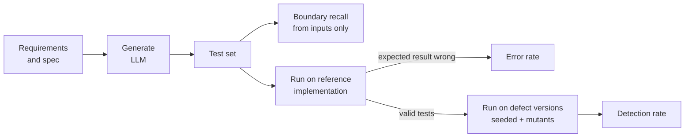
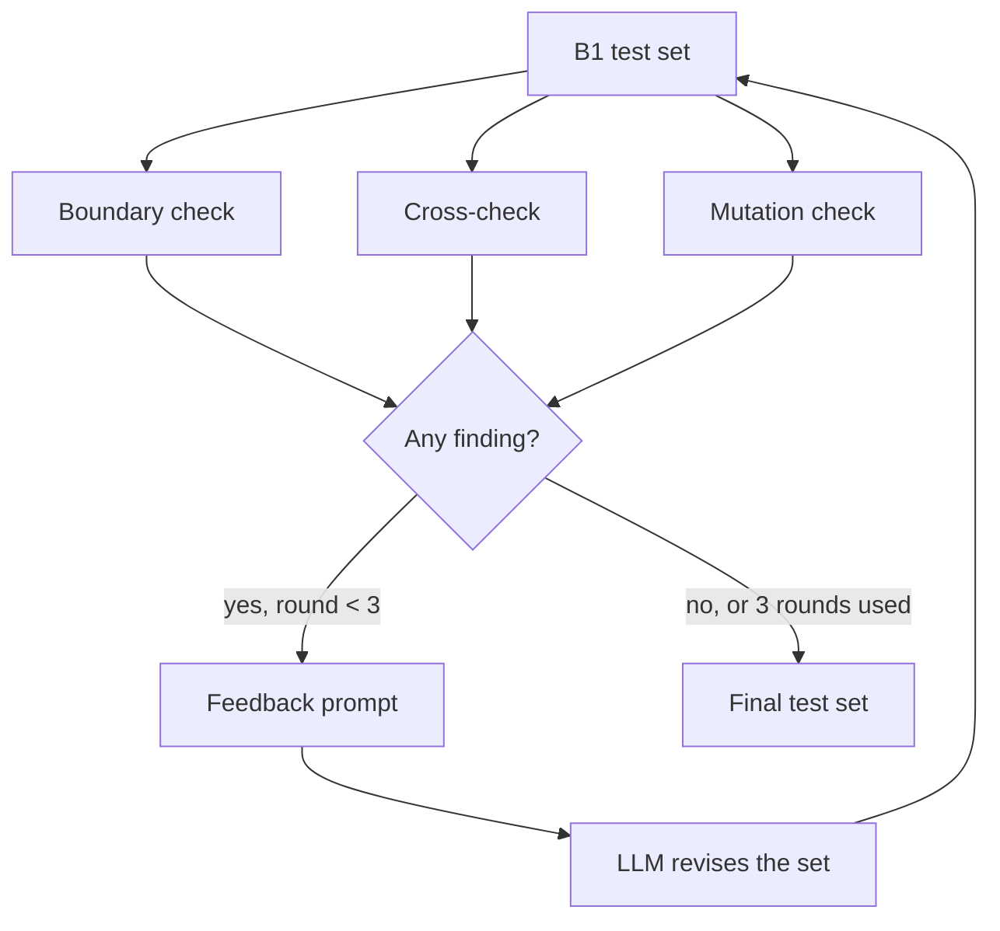

<div align="center">

# llm-testcase-review

**How good are LLM-written test cases, measured by running them?<br>An execution-based evaluation and a feedback loop that repairs the test set.**

[](https://github.com/eungyun-im/llm-testcase-review/actions/workflows/test.yml)


[Overview](#overview) · [Metrics](#metrics) · [Feedback refinement](#feedback-refinement) · [Experiment](#experiment-design) · [Results](#results) · [Layout](#repository-layout) · [Run](#running)

</div>

---

## Overview

An LLM can turn a requirement into test cases in seconds. Whether those test cases are any good is usually judged by a person reading them. That judgment varies between readers and cannot be repeated at scale.

This project measures LLM-written test cases by **executing** them:

1. Run every generated test on a reference implementation. A test whose expected result disagrees is a wrong test.
2. Run the remaining tests on versions of the code with known defects. A defect is detected when at least one test fails on it.

On top of that evaluation it implements **feedback refinement (FR)**: three automatic checks inspect a generated test set, and their findings are sent back to the model for up to three rounds.

The system under test is the AEB-lite decision function from [automotive-sw-qa](https://github.com/eungyun-im/automotive-sw-qa). ISO 26262-6 recommends boundary value analysis for software unit testing, which is why boundary coverage is a first-class metric here.

> **Status:** the evaluation, the feedback loop, the experiment runner and the result tables are implemented and tested. The experiment has not been run on a real model yet, so there are no results to report. The human baseline test set and the equivalent-mutant review are open.



## Metrics

All three are computed by scripts. A person decides only which mutants are equivalent.

| Metric | Definition | Answers |
|---|---|---|
| **Error rate** | tests that fail on the reference implementation ÷ generated tests | How often is the expected result wrong? |
| **Boundary recall** | boundary points used by some test ÷ boundary points in the spec | Are the thresholds tested just below, at, and just above? |
| **Detection rate** | defect versions on which a valid test fails ÷ defect versions (equivalent mutants excluded) | Do the tests catch real mistakes? |
| **Cost** | LLM calls and tokens per final test set | What does the improvement cost? |

The spec lists 5 boundaries, so there are 15 boundary points. Recall is reported two ways. **Simple** counts a point when its value appears in a test. **Strict** also requires the other inputs to let that boundary decide the output: 30.0 km/h counts only if an obstacle is in range.

Detection is measured only with **valid** tests. A wrong test fails everywhere and would otherwise count as detecting every defect.

## Feedback refinement



| Check | Uses | Finds | Feedback example |
|---|---|---|---|
| Boundary | Structured spec | Boundary points no test uses | `speed_kph = 30.1 (just above the B-BRAKE-SPEED boundary)` |
| Cross-check | Requirement text | Tests whose expected result loses a 3-vote recomputation | `TC-07: an independent recomputation gives BRAKE` |
| Mutation | Code under test | Code changes no test input would expose | ``line 28: `speed_kph >= BRAKE_SPEED_KPH` changed to `speed_kph > BRAKE_SPEED_KPH` `` |

Two rules keep the comparison fair:

- **No answer leakage.** Feedback never says which tests failed on the reference implementation. The mutation check compares the mutant with the code under test on the test inputs and ignores expected results.
- **Separate defect sets.** Mutants are split in half, balanced by mutation operator. One half is used for feedback, the other only for scoring. Hand-seeded defects are never used as feedback.

## Experiment design

| Condition | What the model gets | Role |
|---|---|---|
| B0 | Requirements, one generation | Common practice |
| B1 | Requirements, design techniques and the structured spec, one generation | Strong baseline |
| FR | B1 output, refined with all three checks | Proposed method |
| FR without boundary / cross-check / mutation | FR with one check removed | Contribution of each check |
| H | Human-designed test set, evaluated once | Reference point |

FR and its ablations start from the same B1 output in each repetition, so they are compared pairwise (Wilcoxon signed-rank). Unpaired comparisons use Mann-Whitney U. Effect size is Vargha-Delaney A12, and p-values are Holm-adjusted.

**Defect versions for AEB-lite**

| Set | Count | Used for |
|---|---|---|
| Hand-seeded (F1 to F7) | 7 | Scoring only |
| Mutants, evaluation half | 12 | Scoring only |
| Mutants, feedback half | 13 | Mutation feedback only |

Seeded defects are mistakes a developer could plausibly make: an exclusive comparison at a threshold, a missing range check, "no obstacle" treated as distance zero, checks in the wrong order, a distance rounded before comparison. See [`sut/defects.py`](sut/defects.py).

Everything a run produces is stored in SQLite: prompts, raw model output, parsed tests, detections and metrics ([`tcgen/schema.sql`](tcgen/schema.sql)). Any number in a result table can be recomputed from the stored tests.

## Results

None yet. The tables below are produced by `python -m tcgen.report` once the experiment has been run on a real model.

**Table 1. Metrics by condition** (mean ± standard deviation over repetitions)

| Condition | Tests | Error rate | Boundary recall (simple / strict) | Detection: seeded | Detection: mutants | LLM calls |
|---|---|---|---|---|---|---|
| B0 | | | | | | |
| B1 | | | | | | |
| FR | | | | | | |
| FR without boundary feedback | | | | | | |
| FR without cross-check | | | | | | |
| FR without mutation feedback | | | | | | |
| H | | | | | | |

**Table 2. Seeded defects detected** (runs that detected the defect ÷ runs), one row per defect F1 to F7.

**Table 3. Statistical comparisons** (test, means, A12, p, Holm-adjusted p).

The pipeline is exercised in CI with a built-in simulator instead of a model. The simulator exists to run every code path. Its output is marked as simulated in the database and in the report, and it is not evidence about any real model.

## Repository layout

```
llm-testcase-review/
├── requirements/        Structured spec: inputs, requirements, boundaries
├── prompts/             B0, B1, feedback and cross-check prompts
├── sut/
│   ├── aeb.py           Reference implementation (the oracle)
│   └── defects.py       Hand-seeded defect versions F1 to F7
├── tcgen/
│   ├── spec.py          Spec loading and boundary points
│   ├── schema.py        Test case format and tolerant CSV parsing
│   ├── metrics.py       Error rate, boundary recall, detection rate
│   ├── mutation.py      Mutant generation and the feedback / evaluation split
│   ├── checks.py        Boundary check, cross-check, mutation check
│   ├── refine.py        Feedback refinement loop
│   ├── generate.py      B0 and B1 generation
│   ├── llm.py           LLM clients
│   ├── simulator.py     Stand-in client for pipeline tests
│   ├── experiment.py    Experiment runner
│   ├── stats.py         Wilcoxon, Mann-Whitney, A12, Holm
│   ├── report.py        Result tables
│   └── store.py         SQLite store
├── data/
│   ├── human/           Human baseline test set (condition H)
│   └── mutants/         Equivalent-mutant decisions
└── tests/
```

## Running

```bash
pip install -r requirements.txt
pytest -v
```

Run the whole pipeline on the simulator (no API key needed):

```bash
python -m tcgen.experiment --client simulated --reps 3 --db data/results.db
```

```bash
python -m tcgen.report --db data/results.db
```

Run on a real model (needs `pip install -r requirements-llm.txt` and API credentials):

```bash
python -m tcgen.experiment --client anthropic --reps 10 --db data/results.db
```

The model and effort level are fixed for a run and recorded with it. No fallback model is configured: a refused or truncated generation is stored as a failed run instead of being answered by a different model.

## Roadmap

**Core**

- [x] Execution-based metrics: error rate, boundary recall (simple and strict), detection rate
- [x] Mutant generation with a feedback / evaluation split
- [x] Hand-seeded defect versions
- [x] Boundary check, cross-check and mutation check
- [x] Feedback refinement loop with ablations
- [x] Experiment runner, SQLite store, result tables and statistics
- [ ] Human baseline test set, designed before looking at the defects
- [ ] Equivalent-mutant review
- [ ] Pilot on a real model, then the full run with results published here

**Next**

- [ ] Same-size subsampling, to separate "better tests" from "more tests"
- [ ] Second system: UDS diagnostics from [ecu-quality-gate](https://github.com/eungyun-im/ecu-quality-gate), with sequence-style test cases

**Later**

- [ ] Stateful requirements (fault latch and recovery)
- [ ] Comparison across models

## References

- Jia and Harman (2011). An analysis and survey of the development of mutation testing. IEEE TSE.
- Just et al. (2014). Are mutants a valid substitute for real faults in software testing? FSE.
- Barr et al. (2015). The oracle problem in software testing: a survey. IEEE TSE.
- Dakhel et al. (2023). Effective test generation using pre-trained large language models and mutation testing. arXiv:2308.16557.
- Madaan et al. (2023). Self-Refine: iterative refinement with self-feedback. NeurIPS.
- Wang et al. (2023). Self-consistency improves chain of thought reasoning in language models. ICLR.
- Arcuri and Briand (2011). A practical guide for using statistical tests to assess randomized algorithms in software engineering. ICSE.
- ISO 26262-6:2018. Road vehicles, functional safety, product development at the software level.
