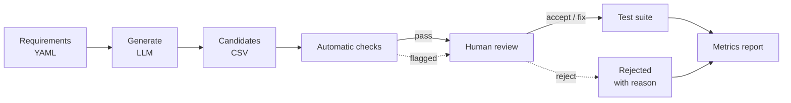

<div align="center">

# llm-testcase-review

**LLM-generated test cases, checked by rules and signed off by a human<br>before they reach the test suite.**

[](https://github.com/eungyun-im/llm-testcase-review/actions/workflows/test.yml)


[Overview](#overview) · [Pipeline](#pipeline) · [Automatic checks](#automatic-checks) · [Human review](#human-review) · [Metrics](#metrics) · [Layout](#repository-layout)

</div>

---

## Overview

An LLM can draft test cases from a requirement in seconds. It also misses boundary values, repeats itself, and states expected results that the requirement does not support. This project treats LLM output as a **candidate list**, never as a finished test suite.

Each candidate passes through two gates:

1. **Automatic checks** that need no judgment: schema, traceability, duplicates, boundary coverage.
2. **Human review** where every candidate is accepted, fixed, or rejected with a recorded reason.

Only accepted and fixed cases are exported to the suite. The project reports how many candidates survived each gate and what the LLM got wrong.

The requirements under test are the five AEB-lite requirements from [automotive-sw-qa](https://github.com/eungyun-im/automotive-sw-qa).

> **Status:** work in progress. The pipeline structure, requirement spec, prompt, and review format are in place. The generator, checks, and report are being implemented.

## Pipeline



## Automatic checks

Deterministic rules that run in CI without calling an LLM.

| Check | What it catches |
|---|---|
| Schema | Missing fields, wrong types, unknown expected result |
| Traceability | Test case that cites no requirement, or one that does not exist |
| Duplicate | Two cases with the same inputs and expected result |
| Boundary coverage | A threshold in the requirement with no case just below, at, and just above it |
| Range | Input outside the physical range declared in the requirement spec |

Thresholds come from [`requirements/aeb_requirements.yaml`](requirements/aeb_requirements.yaml), so the boundary check knows that 30 km/h needs 29.9, 30.0, and 30.1.

## Human review

Every candidate gets one decision, recorded in [`data/reviews/`](data/reviews).

| Decision | Meaning |
|---|---|
| `accept` | Correct as generated |
| `fix` | Useful, but input or expected result was corrected |
| `reject` | Wrong, redundant, or outside the requirement |

Each `fix` and `reject` carries a reason code: `wrong_expected`, `missed_boundary`, `duplicate`, `not_in_requirement`, `untestable`. Guidelines: [`docs/review_guidelines.md`](docs/review_guidelines.md)

## Metrics

Reported per requirement and per run once the first runs are complete.

| Metric | Definition |
|---|---|
| Acceptance rate | accepted ÷ generated |
| Fix rate | fixed ÷ generated |
| Rejection rate | rejected ÷ generated, broken down by reason code |
| Boundary recall | boundaries covered by raw LLM output ÷ boundaries declared in the spec |
| Human-added cases | cases the reviewer had to write because the LLM produced none |

## Repository layout

```
llm-testcase-review/
├── requirements/        Machine-readable requirement spec
├── prompts/             Generation prompt
├── tcgen/
│   ├── schema.py        Test case fields
│   ├── generate.py      Requirement to candidates (LLM)
│   ├── lint.py          Automatic checks
│   ├── review.py        Apply review decisions
│   └── report.py        Metrics
├── data/
│   ├── candidates/      Raw LLM output
│   ├── reviews/         Review decisions
│   └── suite/           Final test cases
├── tests/               Tests for the automatic checks
└── docs/                Review guidelines
```

## Running

```bash
pip install -r requirements.txt
pytest -v
```

The automatic checks and their tests run offline. Only `tcgen/generate.py` needs an LLM API key.
